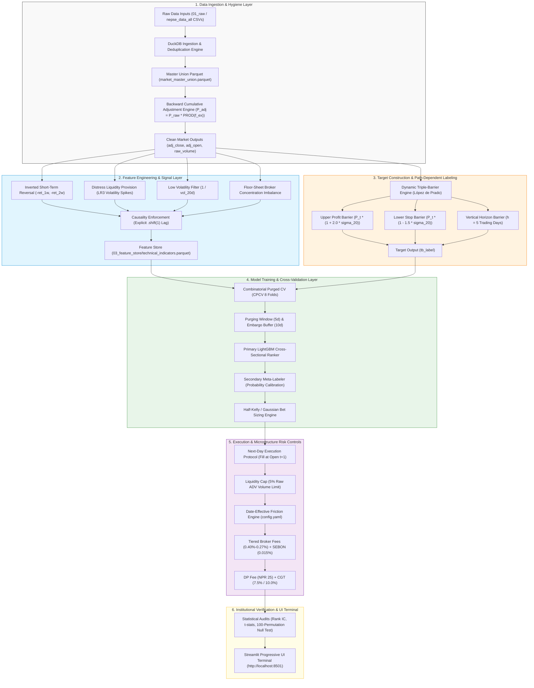
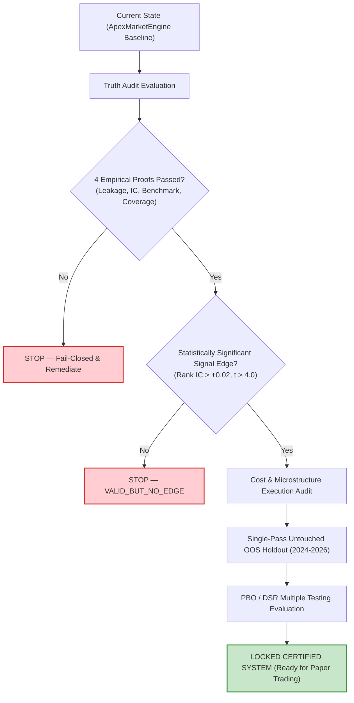

# 🏗️ APEXMARKETENGINE — END-TO-END MASTER PIPELINE ARCHITECTURE (6 LAYERS / 28 SUB-COMPONENTS)

```mermaid
flowchart TD
    subgraph Layer1["1. Data Ingestion & Hygiene Layer"]
        L1_1["Raw Data Inputs (01_raw / nepse_data_all CSVs)"] --> L1_2["DuckDB Ingestion & Deduplication Engine"]
        L1_2 --> L1_3["Master Union Parquet (market_master_union.parquet)"]
        L1_3 --> L1_4["Backward Cumulative Adjustment Engine (P_adj = P_raw * PROD(f_ex))"]
        L1_4 --> L1_5["Clean Market Outputs (adj_close, adj_open, raw_volume)"]
    end

    subgraph Layer2["2. Feature Engineering & Signal Layer"]
        L1_5 --> L2_1["Inverted Short-Term Reversal (-ret_1w, -ret_2w)"]
        L1_5 --> L2_2["Distress Liquidity Provision (LR3 Volatility Spikes)"]
        L1_5 --> L2_3["Low Volatility Filter (1 / vol_20d)"]
        L1_5 --> L2_4["Floor-Sheet Broker Concentration Imbalance"]
        
        L2_1 & L2_2 & L2_3 & L2_4 --> L2_5["Causality Enforcement (Explicit .shift(1) Lag)"]
        L2_5 --> L2_6["Feature Store (03_feature_store/technical_indicators.parquet)"]
    end

    subgraph Layer3["3. Target Construction & Path-Dependent Labeling"]
        L1_5 --> L3_1["Dynamic Triple-Barrier Engine (López de Prado)"]
        L3_1 --> L3_2["Upper Profit Barrier (P_t * (1 + 2.0 * sigma_20))"]
        L3_1 --> L3_3["Lower Stop Barrier (P_t * (1 - 1.5 * sigma_20))"]
        L3_1 --> L3_4["Vertical Horizon Barrier (h = 5 Trading Days)"]
        L3_2 & L3_3 & L3_4 --> L3_5["Target Output (tb_label)"]
    end

    subgraph Layer4["4. Model Training & Cross-Validation Layer"]
        L2_6 & L3_5 --> L4_1["Combinatorial Purged CV (CPCV 8 Folds)"]
        L4_1 --> L4_2["Purging Window (5d) & Embargo Buffer (10d)"]
        L4_2 --> L4_3["Primary LightGBM Cross-Sectional Ranker"]
        L4_3 --> L4_4["Secondary Meta-Labeler (Probability Calibration)"]
        L4_4 --> L4_5["Half-Kelly / Gaussian Bet Sizing Engine"]
    end

    subgraph Layer5["5. Execution & Microstructure Risk Controls"]
        L4_5 --> L5_1["Next-Day Execution Protocol (Fill at Open t+1)"]
        L5_1 --> L5_2["Liquidity Cap (5% Raw ADV Volume Limit)"]
        L5_2 --> L5_3["Date-Effective Friction Engine (config.yaml)"]
        L5_3 --> L5_4["Tiered Broker Fees (0.40%-0.27%) + SEBON (0.015%)"]
        L5_4 --> L5_5["DP Fee (NPR 25) + CGT (7.5% / 10.0%)"]
    end

    subgraph Layer6["6. Institutional Verification & UI Terminal"]
        L5_5 --> L6_1["Statistical Audits (Rank IC, t-stats, 100-Permutation Null Test)"]
        L6_1 --> L6_2["Streamlit Progressive UI Terminal (http://localhost:8501)"]
    end

    style Layer1 fill:#f9f9f9,stroke:#333,stroke-width:1px
    style Layer2 fill:#e1f5fe,stroke:#0288d1,stroke-width:1px
    style Layer3 fill:#fff3e0,stroke:#f57c00,stroke-width:1px
    style Layer4 fill:#e8f5e9,stroke:#388e3c,stroke-width:1px
    style Layer5 fill:#f3e5f5,stroke:#7b1fa2,stroke-width:1px
    style Layer6 fill:#fffde7,stroke:#fbc02d,stroke-width:1px
```

---

## 🏛️ Truth Audit Decision Gate Flowchart

```mermaid
flowchart TD
    State["Current State (ApexMarketEngine Baseline)"] --> TruthAudit["Truth Audit Evaluation"]
    TruthAudit --> FourProofs{"4 Empirical Proofs Passed?<br>(Leakage, IC, Benchmark, Coverage)"}
    
    FourProofs -- No --> Stop1["STOP — Fail-Closed & Remediate"]
    FourProofs -- Yes --> SignalCheck{"Statistically Significant Signal Edge?<br>(Rank IC > +0.02, t > 4.0)"}
    
    SignalCheck -- No --> Stop2["STOP — VALID_BUT_NO_EDGE"]
    SignalCheck -- Yes --> CostAudit["Cost & Microstructure Execution Audit"]
    
    CostAudit --> OOSHoldout["Single-Pass Untouched OOS Holdout (2024-2026)"]
    OOSHoldout --> PBODSR["PBO / DSR Multiple Testing Evaluation"]
    PBODSR --> LockedSystem["LOCKED CERTIFIED SYSTEM (Ready for Paper Trading)"]

    style Stop1 fill:#ffcdd2,stroke:#d32f2f,stroke-width:2px
    style Stop2 fill:#ffcdd2,stroke:#d32f2f,stroke-width:2px
    style LockedSystem fill:#c8e6c9,stroke:#388e3c,stroke-width:2px
```
